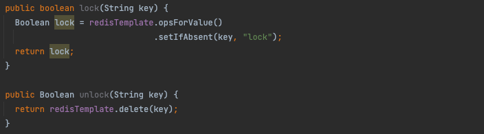

# (1) 동시에 같은 `DB Table row` 를 업데이트 하는 상황을 방어하기 위해 어떻게 개발하실 건지 설명해주세요.

# 동시성(Concurrency)이란?

동시성의 사전적 의미는 빠르게 전환하며 여러 작업을 수행하여 동시에 여러 작업이 실행되는 것처럼 보이는 것을 의미한다.

하지만 구체적으로 DB에서의 동시성은 조금 다르게 해석할 수 있다.

동시성은 여러 요청이 동시에 동일한 자원(data)에 접근하고 수정하려는 것을 의미한다.

```
❓ 비행기를 티켓팅을 한다고 생각해보자.
비행기에 자리가 하나 남은 상황.

A와 B는 같은 비행기 좌석을 예매하려고 한다.
A, B 둘 다 비행기의 잔여 좌석을 확인하기 위해 DB에 접근하게 된다.
이 때 동시에 접근하여 잔여 좌석이 한 자리 남은 것을 확인했다.
그리고 둘 다 예매에 성공한다면 어떤 일이 발생할까?

비행기 자리 하나에 둘 모두 예매가 되어버리는 상황이 발생한다.

```

위와 같이 동시성이 문제가 되는 상황이 있다. 이러한 이유로 개발자는 동시성을 신경 쓰고 적절한 제어를 해주어야 한다.

# 동시성 문제 해결 방법

## 비관적인 접근을 통한 동시성 해결

- 현재 access 하는 row를 다른 transaction들도 access 한다고 생각하고 Lock을 거는 방법
- 데이터를 수정시, 즉시 트랜잭션 충돌을 감지 가능
- DB Level에서 동시성 처리
    - ex) select for update

### 1. transaction 격리 수준 수정

DBMS 자체의 격리 수준을 높인다면 동시성을 해결할 수 있다. 일반적인 기본 수준값인 `Repeatable Read`를 `Serializer` 이상의 수준으로 올린다. 강도 높은 락으로 완전한 일관성을 유지할 수 있다. 하지만, 이로인한 다른 요청들이 모두 취소된다.

격리 수준을 수정하여 하루에도 수십, 수백만 건이 쌓이는 데이터에 동시성을 항상 검토하게 하는 것은 DBMS에 무리가 갈 것이라고 판단했기에 row 단위의 LOCK을 쓰는 것이 적절해보인다.

### 2. select for update

배타 락(exclusive lock)을 적용하는 쿼리로 'update를 하기 위해 select를 한다.'

즉, '이 데이터는 내가 조회하여 수정 중이기 때문에 다른 사람은 건드릴 수 없다.' 는 뜻이라고 할 수 있으며, 다르게 이야기하면 동시성 제어를 위해 특정 데이터에 대해서 Lock을 거는 방식입니다.

JPA에서도 select for update를 ORM으로 지원한다.

```java
public interface TransactionTestRepository extends JpaRepository<TransactionTest, Long> {

  @Lock(LockModeType.PESSIMISTIC_FORCE_INCREMENT)
  @QueryHints({@QueryHint(name = "javax.persistence.lock.timeout", value = "1000")})
  TransactionTest findById(Long id);
}
```

JpaRepository에서는 이러한 방식으로 Lock을 설정할 수 있으며, 해당 옵션에 따른 내용은 다음과 같다.

`@Lock(LockModeType.PESSIMISTIC_WRITE)` : 해당 리소스에 배타 락을 건다. 다른 트랜잭션에서는 읽기와 쓰기 모두 불가능

transaction을 시작한 뒤, for update 문을 사용하면 조회된 row에 대해서는 transaction이 종료(Commit or Rollback)될 때까지 CRUD가 차단된다.

해당 Row에 대한 Access가 발생할 경우, 해당 Request에서는 Lock Wait라는 상황으로 응답하며, Transaction이 종료될 때까지 기다리도록 합니다.

하지만 이 방식의 문제점이 있다. 상황에 따라 Lock이 발생한 row에 접근하기 위해 무한히 대기하는 상황이 발생하여 Deadlock을 발생시킬 수 있다.

### 3. redis

redis를 사용하여 application 단에서 Lock를 잡는 방식이다.

redis는 싱글 스레드이기 때문에 여러 서버에서 동시에 접근하여도 순차적인 처리를 보장해준다. 즉, 동시성을 보장해준다.

redis의 setnx 명령어를 이용하여 Lock을 관리한다. setnx는 set if not exists의 약어로 key가 없을 때만 set을 하는 특징을 가지고 있는 명령어이다. 값이 set 됐다면 1을 set 되지 않았다면 0 을 반환하는 특성을 사용하여 atomic하게 Lock 획득 여부를 결정한다.



## 낙관적인 접근을 통한 동시성 해결

- transaction 충돌이 발생하지 않을 것이라 가정하고 Lock을 거는 방법
- 트랜잭션을 commit 하는 시점에 충돌을 알 수 있음
- Application Level에서 동시성 처리

낙관적인 접근은 version이라는 칼럼이나 updated_at 칼럼을 사용한다. 데이터를 수정할 때마다 version을 1 증가하거나 updated_at을 현재 시각으로 갱신한다.

JPA에서도 마찬가지로 versioning을 자체적으로 지원한다.  `@Version` ****애노테이션을 이용해 처리하면 되는데, `@Version` 은 버전 관리용 필드를 추가해 트랜잭션 내에서 처음 조회되었을 때의 버전과 이후 수정 후 커밋될 때의 버전을 비교한다.

재고를 차감하는 예를 들어보겠다.

```
❓ [transaction-1] : 햄버거A의 재고를 확인 / 햄버거A 재고: 1개, version: 1
[transaction-2] : 햄버거A의 재고를 확인 / 햄버거A 재고: 1개, version: 1

- 이때 두 트랜잭션 중 transaction-1 가 먼저 완료되었다고 가정해보겠습니다.

[transaction-1] : 햄버거A를 구매 / 햄버거A 재고: 0개, version: 2 로 업데이트하고 커밋
[transaction-2] : 햄버거A를 구매 / 햄버거A 재고: 0개, version: 2 로 업데이트하고 커밋하려는데
version이 처음 조회했던 1이 아니라 [transaction-1]에서 2로 변경되어 현재 조회한 버전과 다르므로 업데이트 실패

```

transaction-2에서 아래와 같은 쿼리가 발생하지만 해당 햄버거A의 재고의 version은 transaction-1으로 인해 이미 2로 증가된 상태이다. 이때 처음 조회했던 version 값인 1을 전달하게 되니 업데이트할 대상을 찾이 못해 예예외가 발생한다.
