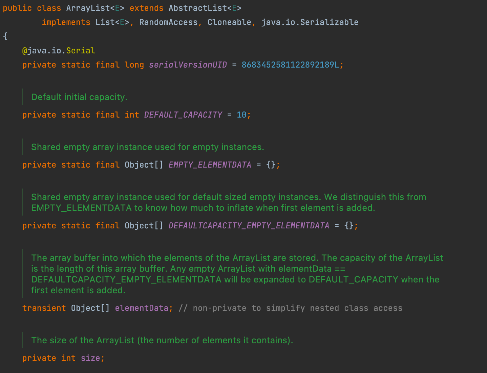
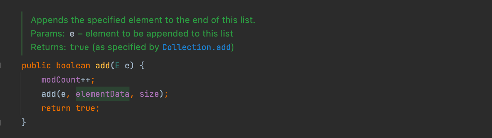
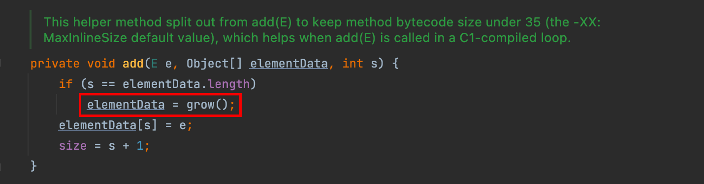
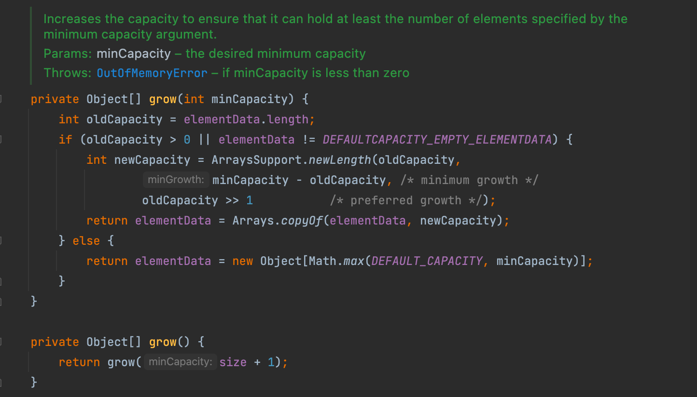
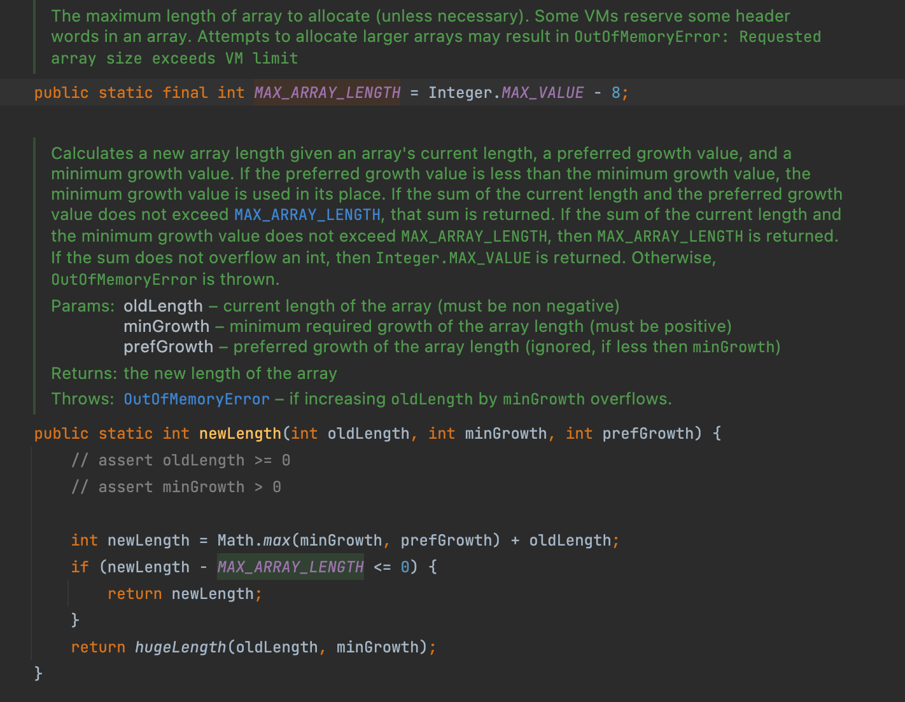
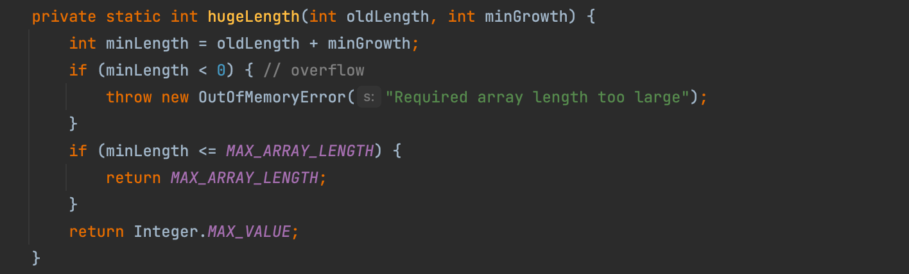

# (5) 본인이 주력으로 사용하는 언어에서 자료구조와 관련 된 클래스가 내부적으로 어떻게 동작하는지 한 가지 사례를 정하여 작성해주세요. ex) `ArrayList`, `HashMap` 등등

# ArrayList란 무엇인가?

ArrayList는 List 인터페이스를 상속받은 구현체로 크기가 가변적으로 변하는 선형리스트이다.

# ArrayList의 특징

- 내부 저장소가 연속적인 메모리 형태이며 인덱스로 내부의 객체를 관리한다는 점에서 배열과 유사하다.
- 한 번 생성되면 크기가 변하지 않은 배열과 달리 ArrayList는 객체들이 추가되어 저장 용량(capacity)를 초과한다면 자동으로 부족한 크기만큼 저장 용량이 늘어난다.
- 데이터 중복이 가능하며, null 값도 허용한다.
- 자료를 대량으로 추가하거나 삭하면 내부 처리 작업이 늘어나서 성능이 떨어 질 수 있다.

# ArrayList add() 동작 방식

```java
public void makeArrayListObject() {
	List<String> list = new ArrayList();
	
	list.add("wanted");
}
```



ArrayList는 내부에서 `elementData` 배열을 기반으로 구성되어 있다. 위의 코드와 같이 new 생성자를 통해 기본 생성자를 호출하면 `elementData`에 `EMPTY_ELEMENTDATA`(빈 Object 배열)을 할당한다. 이렇게 되면 `size`는 0에 `DEFAULT_CAPACITY`는 10으로 설정된 ArrayList 객체가 생성된다. 물론 생성자를 통해서 직접 `elementData` 배열의 capacity 설정도 가능하다.

## add() 내부 구조



`add()` 메소드는 리스트의 끝에 요소를 추가하는 것이다. `add()` 메소드를 통해 String 객체 하나를 넣으면 ArrayList 클래스 내부에 private `add()` 메소드를 호출한다.



이 메소드의 두 번째 파라미터는 오브젝트형 배열을 인자로 받고 있고, 세 번째 파라미터는 int형 정수인 size를 받고 있다.

`s`와 `elementData`의 길이를 비교하여 배열의 사이즈를 조정해야 하는지 체크한다. 배열의 사이즈를 조정해야 한다면, 빨간색 네모 부분인 `grow()` 메소드를 호출하여 배열의 크기를 동적으로 늘어나게 해준다.

- `size = s + 1;` : 클라이언트에서 보여질 arrayList의 사이즈를 늘린다. arrayList에서 `size()` 메소드를 사용하면 해당 변수를 반환한다.

## grow() 내부 구조



파라미터가 없는 두 번째 `grow()` 은 `minCapacity`(최소 용량)로 현재 사이즈에서 1을 더한 값을 인자로 넣어주어 첫 번째 `grow()` 메소드를 호출한다.

`minCapacity`를 파라미터로 갖는 첫 번째 `grow(int minCapacity)`는 기존의 `elemantData`를 `newCapacity` 길이만큼 새로 늘어난 배열에 카피한다.

- `if (oldCapacity > 0 || elementData != *DEFAULTCAPACITY_EMPTY_ELEMENTDATA*)` :  먼저 현재 arrayList가 비어 있는지 아닌지 확인한다. 비어 있을 경우, else로 기본 용량인 10과 size + 1 중 큰 값으로 새 Obejct 배열을 생성한다. 그렇지 않은 경우, 새로운 capacity로 크기를 확장해준다.
- `int newCapacity = ArraysSupport.newLength(oldCapacity, minCapacity - oldCapacity, oldCapacity >> 1);`
    - `oldCapacity` : 기존 용량
    - `minCapacity - oldCapacity` : (size + 1) - (elementData.length) = 일반적으로 최소 증가값은 1이 된다.
    - `oldCapacity >> 1` : 기존 용량 / 2 (우측 쉬프트 연산)



- `int prefLength = oldLength + Math.max(minGrowth, prefGrowth)` : 얼마나 늘린지 용량을 정하는 `newLength` 을 설정한다. 기존 arrayList가 만약 10이라고 한다면 `minGrowth`, `prefGrowth` 중 더 큰 값인 5를 더해 15로 설정한다. 결국 기존 크기에서 1.5배로 늘려 새로운 크기를 결정하는 것이다.
- `if (newLength - *MAX_ARRAY_LENGTH* <= 0)` : 새로운 용량이 `SOFT_MAX_ARRAY_LENGTH` 를 넘어가지 않을 경우, 그대로 넘겨주지만 최대 용량 값을 넘는 경우 `hugeLenth()` 메소드를 호출한다.



- `int minLength = oldLength + minGrowth;` : 기존 크기와 최소 증가값을 더해서 설정한 최소 용량이 0보다 작은 경우 `OutOfMemoryError` 발생시킨다. `SOFT_MAX_ARRAY_LENGTH` 이하인 경우에는 설정된 int의 최대치를 용량으로 부여한다.

# 결론

ArrayList는 새 요소를 추가하고자 할 때, capacity가 기존 배열의 크기가 같아지면 기존 용량의 1.5배만큼 증가시키고, 그 크기가 늘어난 배열에 기존 elementData를 copy한다. 이를 보았을 때 실제로는 정적 배열을 사용하지만, 요소가 추가할 때마다 최소 증가량을 계산하여 크기를 늘리는 방식이라는 것을 알 수 있다.